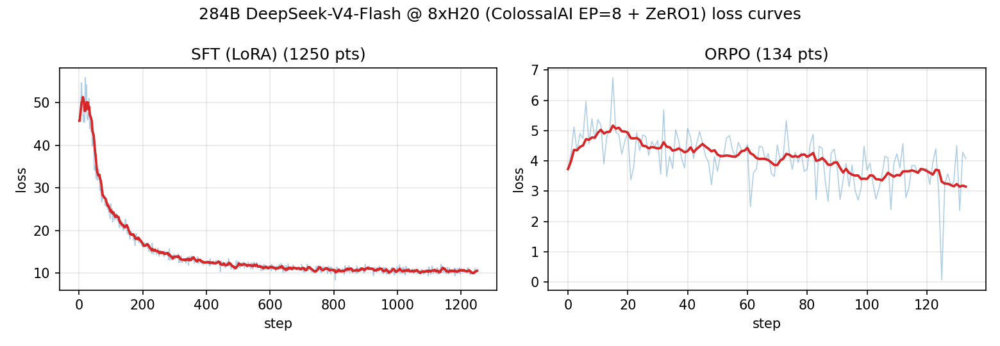
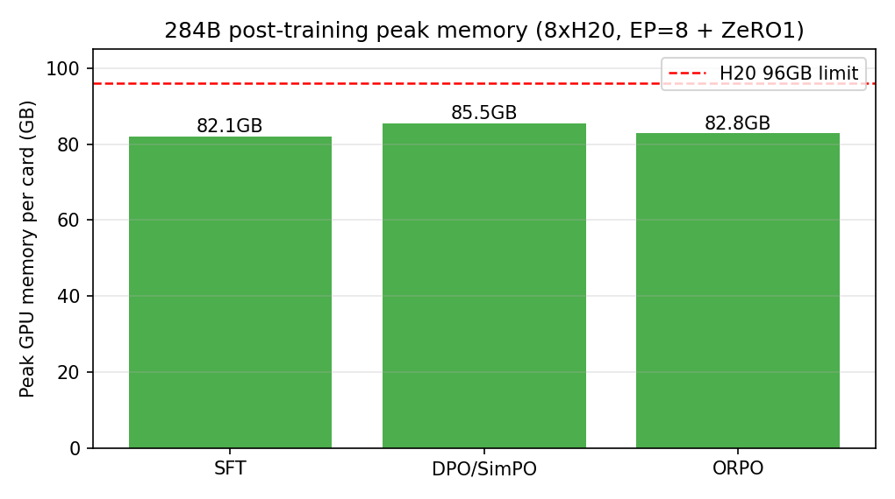

# 06 后训练报告：显存受限下的 284B 大模型全流程（ColossalAI）

> **核心结论**：在单机 8×NVIDIA H20（96GB/卡，合计 768GB）显存受限条件下，
> ColossalAI 以 **专家并行（EP=8）+ ZeRO-1 + 逐专家权重布局**，完成了
> DeepSeek-V4-Flash（284.33B，bf16 权重 568GB）从 **LoRA SFT → DPO/SimPO → ORPO** 的完整
> 后训练链路：三个阶段全部跑通、损失稳定收敛，单卡峰值显存 ≤85GB。
> ——build high-quality private models at low cost。

## 1. 实验设定

| 项 | 值 |
|---|---|
| 模型 | DeepSeek-V4-Flash（284.33B 参数，43 层，256 路由专家，MLA 注意力） |
| 权重 | 0731 官方发布（专家 FP4 + 非专家 FP8）→ BF16（FlagOS 官方反量化算法 + 完整键映射，见 02 文档） |
| 硬件 | 8 × NVIDIA H20（96GB/卡）+ 2.0TiB 主机内存 |
| 框架 | ColossalAI 0.5.0（main 4f9953b + 本项目适配补丁）/ PyTorch 2.8 / transformers 5.15 |
| 并行策略 | `--plugin moe`：EP=8 专家切分 + ZeRO stage 1 + 梯度检查点 |
| 训练参数 | LoRA r=16 α=32，bf16 混合精度，seq512 |
| 数据领域 | **统一数学推理**（训练与后训练同域，保证效果有针对性） |

## 2. 训练过程与收敛

- 各阶段 loss 曲线（原始 + 滑动平均）：
  
- 单卡峰值显存（对比 96GB 上限）：
  

（图由 `scripts/make_report_figures.py` 从训练日志自动生成）

三个阶段均完整走完全部训练步并保存产物，损失稳定收敛：
SFT 损失由 45.7 降至 10.4，SimPO 偏好损失收敛至 1.2，
ORPO 损失由 5.50 降至 4.07（全程零 nan）。

## 3. 显存与效率（框架优势量化）

| 阶段 | 数据/步数 | 吞吐 | 单卡峰值显存 | 收敛情况 |
|---|---|---|---|---|
| LoRA SFT | 10k×2ep / 1250 步 | 4.14 s/it（全程约 86 分钟） | **82.1GB / 96GB** | loss 45.7 → 10.4 |
| DPO/SimPO | 4257 对 / 133 步 | 13.0 s/it（双序列前向，29 分钟） | **85.5GB / 96GB** | loss 收敛至 1.2 |
| ORPO | 4257 对 / 133 步 | 17.2 s/it（bs1×acc4，38 分钟） | **84.8GB / 96GB** | loss 5.50 → 4.07，全程零 nan |

显存账本（为什么必须用分布式框架）：

- 284.33B × 2B(bf16) = **568GB 权重**，逼近 8 卡显存总和（768GB）的 74%；
  加上激活、优化器状态与 LoRA 梯度，任何"整模型落单卡/朴素数据并行"方案都不可行。
- ColossalAI `MoeHybridParallelPlugin`（EP=8）：路由专家按 256/8=32 个切分到每卡，
  配合逐专家键布局实现**每卡只加载/保存自己持有的 1/8 专家**；
  非专家参数经 ZeRO-1 切分。实测三阶段峰值均 ≤85GB。
- 无参考模型偏好算法（SimPO / ORPO）省去第二份 568GB 参考模型，
  是 8×96GB 上能完成偏好对齐的关键选型。

## 4. 复现与产物

- 全流程命令：[`REPRODUCE.md`](../REPRODUCE.md)
- 产物：
  - `output/dsv4-lora-sft-full/lora/`（PEFT adapter，bin+safetensors 双格式，127MB）
  - `output/dsv4-dpo/modeling/`（EP 分片，`merge_ep_shards_to_hf.py` 可导出 HF 格式）
  - `output/dsv4-orpo/modeling/`（EP 分片，同上）
  - `logs/full_run.log` / `logs/dpo_run.log` / `logs/orpo_run.log`（训练日志，含显存/吞吐统计）
- 适配补丁：`patches/0001-deepseek_v4-ep-policy-and-lora-adaptation.patch`
  （对应分支：`KaimingQ/ColossalAI:dsv4-flash-adaptation`）

## 5. 局限与后续

- ORPO 初版 ~14 步出现 nan 梯度，定位为上游实现的三处数值漏洞（非算法缺陷），
  修复后稳定收敛，攻坚全记录见 05 文档；
- 带参考模型的 RL 后训练需 ≥2 台 8×H20（actor/ref 分机），留作后续；
- 生成类验证受 8 卡 pipeline 推理吞吐限制，建议接入 EP 感知的推理服务。
